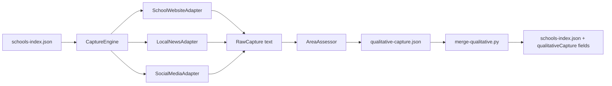

# School Data Crawler

Experimental qualitative data capture engine for [schoolcompass.uk](https://schoolcompass.uk) ([Comparison-tool](https://github.com/jamiefuller320/Comparison-tool)).

The engine scans mixed public sources — school websites, local news positively associated with a school, and official social media pages — and produces **value judgements** on subject areas parents care about:

| Area | What we look for |
|------|------------------|
| **Curriculum** | Subject breadth, sequencing, GCSE/A-level options, academic ambition |
| **Enrichment** | Clubs, sport, music, trips, extra-curricular breadth |
| **Ethos** | Values, vision, inclusion, character, faith context |
| **Behaviour** | Pastoral care, wellbeing, safeguarding signals |
| **SEND** | Inclusion, accessibility, support for additional needs |
| **Community** | Parent engagement, partnerships, charity / local links |

Every judgement is backed by **verifiable excerpts** with `sourceUrl` footnotes — the same provenance pattern as School Compass inspection précis.

> **Experimental** — heuristic lexicon scoring, not LLM paraphrase. Scores reflect *public evidence richness*, not school quality rankings. Treat as research input until parent UX is designed.

## Architecture

```
school_capture/
├── engine.py              # Orchestrates adapters → assessment
├── models.py                # URN-keyed sidecar schemas
├── sources/
│   ├── website.py           # Crawl school site themed pages
│   ├── news.py              # Google News RSS → positive local articles
│   └── social.py            # Discover public social links from homepage
└── analysis/
    ├── lexicons.py          # Theme keywords per subject area
    └── assessor.py          # Value judgements + confidence scores

output/
└── qualitative-capture.json # Batch sidecar index

schemas/qualitative-capture.schema.json
types/qualitative-capture.ts   # Mirror for Comparison-tool types.ts
scripts/merge-qualitative.py   # Join sidecars onto schools-index.json
```

### Data flow



## Quick start

```bash
# Install (stdlib only; pytest optional for tests)
pip install -e ".[dev]"

# Offline test run against fixtures
python3 -m school_capture.cli --fixture tests/fixtures/sample-schools.json \
  --no-news --no-social --limit 1

# Live capture against Comparison-tool Hampshire index (website + news + social)
python3 -m school_capture.cli \
  --comparison-tool /path/to/Comparison-tool \
  --la Hampshire \
  --require-website \
  --limit 3

# Merge sidecars into schools-index (dry-run first)
python3 scripts/merge-qualitative.py \
  --index /path/to/Comparison-tool/public/data/schools-index.json \
  --capture output/qualitative-capture.json \
  --dry-run
```

## Output shape

Each school record in `output/qualitative-capture.json`:

```json
{
  "urn": "116338",
  "name": "Example School",
  "assessedAt": "2026-08-03",
  "engineVersion": "0.1.0",
  "sourcesScanned": 5,
  "sourceTypes": ["school-website", "local-news"],
  "areas": [
    {
      "area": "curriculum",
      "score": 62,
      "confidence": 0.55,
      "summary": "Moderate publicly visible evidence for curriculum (3 excerpts). Themes include broad, gcse, subjects.",
      "themes": ["broad", "gcse", "subjects"],
      "signals": [
        {
          "text": "We offer a broad and balanced curriculum...",
          "sourceUrl": "https://school.example/curriculum",
          "sourceType": "school-website",
          "capturedAt": "2026-08-03",
          "section": "curriculum"
        }
      ]
    }
  ]
}
```

**Score (0–100)** — strength of *public evidence* for that area, not a league-table rank.  
**Confidence (0–1)** — source diversity and excerpt quality.

## Comparison-tool integration

1. Copy `types/qualitative-capture.ts` fields into `Comparison-tool/src/lib/types.ts` as `QualitativeCaptureFields`.
2. Add an enrich step to the harvest chain:

   ```bash
   # In Comparison-tool (future)
   python3 ../School_data_crawler/scripts/merge-qualitative.py \
     --index public/data/schools-index.json \
     --capture ../School_data_crawler/output/qualitative-capture.json
   ```

3. Surface in visit pack / compare boards with source stamps (same pattern as `inspectionPrecis`).

### Suggested npm script (Comparison-tool)

```json
"enrich:qualitative": "python3 ../School_data_crawler/school_capture/cli.py --comparison-tool . --la Hampshire --require-website --limit 50 --no-social && python3 ../School_data_crawler/scripts/merge-qualitative.py --index public/data/schools-index.json"
```

## Design constraints (inherited from School Compass)

- **Provenance first** — every signal footnotes to a source URL; no unattributed claims.
- **URN-keyed sidecars** — mergeable without breaking the static-export model.
- **Hampshire-first** — default LA filter matches `SEED_LOCAL_AUTHORITY`.
- **Bounded batches** — use `--limit` in CI; polite rate limiting between fetches.
- **Parent framing** — evidence for school choice, not governance challenge (contrast with Bartley).

## Source adapters

| Adapter | Discovery | Association rule |
|---------|-----------|------------------|
| `SchoolWebsiteAdapter` | Homepage + themed internal links | Same-site crawl, max 8 pages |
| `LocalNewsAdapter` | Google News RSS for `"{name}" {town}` | Title name-match + positive tone filter |
| `SocialMediaAdapter` | Social links on school homepage | Public page mentions school name |

### Extending

Implement `SourceAdapter` in `school_capture/sources/`:

```python
class MyAdapter:
    source_type = "other"

    def discover(self, school: SchoolInput) -> list[str]: ...
    def capture(self, school: SchoolInput, url: str) -> RawCapture | None: ...
```

Register in `school_capture/sources/__init__.py` `default_adapters()`.

Future adapters: Hampshire FIS feeds, ISC pages, local authority directories.

## Tests

```bash
pytest -q
```

Offline tests mock HTTP and use HTML fixtures under `tests/fixtures/pages/`.

## Quality filters (v0.5)

Phase 1–3 deterministic extraction favours concrete provision over marketing copy:

- URL blocklist (privacy, cookies, accessibility statements, login, etc.)
- Sentence blocklist (cookie banners, compliance text, form labels)
- Main-content HTML extraction (skips nav/footer/aside)
- **Specificity gate** — rejects unevidenced claims ("we are inclusive", "caring community")
- **Structured list extraction** — pulls clubs, subjects, wraparound care from `<ul>`/`<ol>` under headings
- **Section-scoped parsing** — content grouped by h1/h2/h3 headings
- **Cross-page corroboration** — offerings mentioned on multiple pages score higher
- **Site document scan** — discovers PDFs/DOC/XLS linked from crawled pages; extracts text from PDFs (up to 8 per school)
- **Document inventory** — per-school list of discovered files with extraction status in the sidecar and viewer
- Concrete **offerings** list per subject area; summaries lead with listed provision

Disable document extraction for faster runs:

```bash
python -m school_capture.cli --no-documents ...
```

Summarise documents found across a batch:

```bash
python scripts/document-inventory-report.py output/qualitative-capture.json
```

Re-run the pilot after engine changes:

```bash
./scripts/publish-pilot.sh
```

## Pilot viewer (GitHub Pages)

A static viewer for pilot results lives in `docs/`:

```bash
# Re-run pilot and publish JSON to docs/data/
./scripts/publish-pilot.sh

# Or copy existing output without re-capturing
cp output/pilot-qualitative-capture.json docs/data/qualitative-capture.json
```

After pushing to `main`, GitHub Actions deploys to Pages:
**https://jamiefuller320.github.io/School_data_crawler/**

Enable **Settings → Pages → Source: GitHub Actions** on first deploy.

Deployments run from `main` only (feature branches validate via PR checks, not Pages deploy).

The viewer shows per-school area scores, themes, and footnoted excerpts from the Hampshire pilot batch.

## Roadmap

- [x] Hampshire pilot batch + GitHub Pages viewer
- [ ] LLM-assisted extraction **with mandatory verbatim quotes** (opt-in, never replace footnotes)
- [ ] Per-URN incremental cache (`output/cache/{urn}.json`)
- [ ] GitHub Actions workflow with `--limit` for Hampshire soft-launch
- [ ] Comparison-tool UI: qualitative evidence strip on visit pack
- [ ] Interest-weighted refresh (DEFERRED_IDEAS step 7 pattern)

## Licence

Align with Comparison-tool / School Compass project licence.
